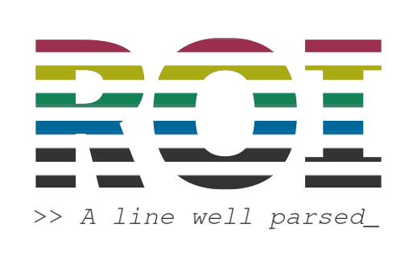

  

# ROI - The rule-oriented interpreter

  
  
  
  

## Architecture

	

## To-do list
|      Resource      |    Status                        |
|--------------------|----------------------------------|
| Dynamic structures | :large_blue_circle: in progress  |
| Handlers           | :large_blue_circle: in progress  |
| AST                | :large_blue_circle: in progress  |
| Lexer              | :white_circle: in planning       |
| Parser             | :white_circle: in planning       |
| Lexical rules      | :black_circle: estimate          |
| Syntactic rules    | :black_circle: estimate          |
| Semantic rules     | :black_circle: estimate          |
| AST Bytecode       | :black_circle: estimate          |
| µUni Runtime       | :red_circle: on hold             |
| Handlers ports     | :red_circle: on hold             |

:large_blue_circle: in progress: the resource is under development  
:white_circle: in planning: the resource is not under development yet, but it's planned to be developed asap.  
:black_circle: estimate: the resource development is estimated to begin right after "in planning" resources became "in progress"  
:red_circle: on hold: the resource depends on features not developed yet.  

---

## Credits

* Author: Gustavo Ale
* GitHub: https://github.com/GustavoAle
* Email: gustavo.engca@gmail.com
